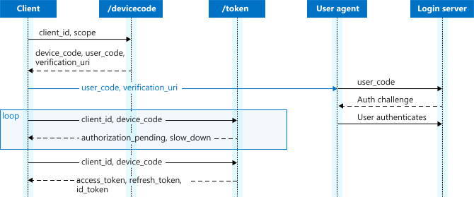
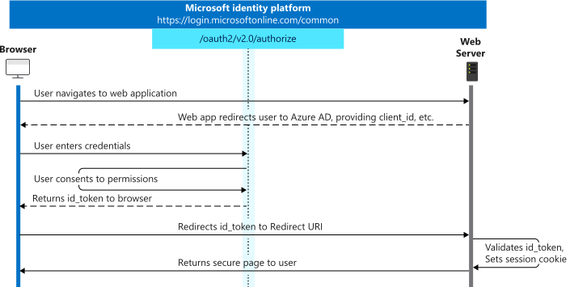

# Secure APIs on Azure behind API Management

## Introduction

Azure API Management is a hybrid, multi-cloud management service for APIs onAzure; ensuring a complete abstraction of backend APIs and its complexities from the consumer of the APIs. This allows API developers to Securely expose APIs to various types of API consumers with varying degree of access control, observability and protection mechanisms available out-of-the-box.

Azure API Management has deep integrations with Azure AD which in turn has support for with the OAuth 2.0 & OpenID Connect through **Microsoft Identity** framework. These two powerful, feature-rich resources can be leveraged to secure backend APIs without adding any code or logic within the APIs itself; thus making the Security of APIs clean, flexible and reusable


## What this Document will do?

- A detailed overview of configurations in Azure AD for **OAuth 2.0** and **OpenID Connect** 
- Deep look at the various protection mechanisms available in **Microsoft Identity** platform
- How to integrate API Management with  **OAuth 2.0** and/or **OpenID Connect** 
- Leverage built-in **Policies** in Azure API Management to secure the backend APIs


## Let us get into some Actions

### Configure Azure AD

#### Register an Application to represent the Back end APIs

- Follow these [Steps](https://docs.microsoft.com/en-us/azure/api-management/api-management-howto-protect-backend-with-aad#1-register-an-application-in-azure-ad-to-represent-the-api) to register

- Let us call this **ServerApp** to better correlate 

- Go to **Manifest** section of the app and update

  - **acceptMappedClaims** to **true** - This is needed to make sure that the Associated Groups are returned as part of the *OAuth 2.0*  or *OpenID* token
  - **groupMembershipClaims** option to **SecurityGroup**

  

  

- Configure **API Permission** section

  

- Add/Modify **Token Configuration** section

  - **Optional** and **Group** claims can be added

  

  

  - [**App Roles**](https://docs.microsoft.com/en-us/azure/active-directory/develop/howto-add-app-roles-in-azure-ad-apps) can also be included in the *Token Configuration*
    - **Roles** will be granted permission by *Administrator*
    - *Administrator* will then add Roles to **Users/Groups**
    - **Roles** are returned as part of the **Token**; *Applications* can use that to appropriate action


  

  

  

  

  

  

- Go to **Expose API** section and Add **Scope**

  


#### Register an Application to represent the Client to Access backend APIs

- Follow these [Steps](https://docs.microsoft.com/en-us/azure/api-management/api-management-howto-protect-backend-with-aad#2-register-another-application-in-azure-ad-to-represent-a-client-application) to register

- Let us call this **ClientApp** to better correlate 

  

  

  

- Go to **Authentication** section and modify as below

  - Select **Multi-tenant** or **Single-tenant** option as per requiremet

  

  

  

  

#### Configure API Management

- Configure as shown in the below screen shots; these are *self-explanatory*


#### API Management Policy

- [Policy Reference Index](https://docs.microsoft.com/en-us/azure/api-management/api-management-policies)

- This document uses [Validate-JWT](https://docs.microsoft.com/en-us/azure/api-management/api-management-access-restriction-policies#ValidateJWT) policy

- Policy can be added at different levels

  - Global

  - Product

  - APIs

    

  ##### Check the validity of the Bearer Token

  ```xml
  <policies>
      <inbound>
          <base />
        <!--Check the validity of the Bearer Token-->
          <validate-jwt header-name="Authorization" failed-validation-httpcode="401" failed-validation-error-message="UnAuthorized">
              <openid-config url="https://login.microsoftonline.com/<tenant-id>/.well-known/openid-configuration" />            
          </validate-jwt>        
      </inbound>
      <backend>
          <base />
      </backend>
      <outbound>
          <base />
      </outbound>
      <on-error>
          <base />
      </on-error>
  </policies>
  ```

  

  ##### Check for Claims in the Bearer Token

  - Let us check the **Audience** value of token
  - **Audience** in **JWT** token is the Scope of the **ClientApp** as configured earlier
  - Create a **Named** value as - ***<aud> = api://<scope>***

  ```xml
  <policies>
      <inbound>
          <base />
  <!--Check the validity of the Bearer Token-->
          <validate-jwt header-name="Authorization" failed-validation-httpcode="401" failed-validation-error-message="UnAuthorized">
              <openid-config url="https://login.microsoftonline.com/<tenant-id>/.well-known/openid-configuration" />
  <!--Check the claims of the Bearer Token-->
              <required-claims>
                  <claim name="aud" match="all">
                      <value>{{aud}}</value>
                  </claim>
              </required-claims>
          </validate-jwt>        
      </inbound>
      <backend>
          <base />
      </backend>
      <outbound>
          <base />
      </outbound>
      <on-error>
          <base />
      </on-error>
  </policies>
  ```

  - This can be extended to check for any **Optional Claims** or **Group Claims** as well

  

  ##### Extract information from Token and send it backend API

  - Additional information from **Bearer Token** can be sent to the backend APIs
  - Backend APIs can use it for some additional decision specific to the API based on the data returned in Token

  ```xml
  <policies>
      <inbound>
          <base />
  <!--Check the validity of the Bearer Token-->
          <validate-jwt header-name="Authorization" failed-validation-httpcode="401" failed-validation-error-message="UnAuthorized">
              <openid-config url="https://login.microsoftonline.com/<tenant-id>/.well-known/openid-configuration" />
  <!--Check the claims of the Bearer Token-->
              <required-claims>
                  <claim name="aud" match="all">
                      <value>{{aud}}</value>
                  </claim>
              </required-claims>
          </validate-jwt>
  <!--Extract AppId from Token and Add this to the request header-->
          <set-header name="appid" exists-action="append">
              <value>@{
                      string appid = "unknown";
                      string authHeader = context.Request.Headers.GetValueOrDefault("Authorization", "");
                      if (authHeader?.Length > 0)
                      {                        
                          string[] authHeaderParts = authHeader.Split(' ');
                          if (authHeaderParts?.Length == 2 && authHeaderParts[0].Equals("Bearer", StringComparison.InvariantCultureIgnoreCase))
                          {
                              Jwt jwt;                                                        
                              if (authHeaderParts[1].TryParseJwt(out jwt))
                              {
                                  
                                  appid = jwt.Claims.GetValueOrDefault("appid", "unknown");
                                  
                              }
                          }
                      }
                      return appid;
                  }</value>
          </set-header>
  <!--Check appid value from Request Header and take decision-->
          <choose>
              <when condition="@(context.Request.Headers.GetValueOrDefault("appid", "unknown") != "{{appid}}")">
                  <set-backend-service base-url="<error url>" />
              </when>
          </choose>
      </inbound>
      <backend>
          <base />
      </backend>
      <outbound>
          <base />
      </outbound>
      <on-error>
          <base />
      </on-error>
  </policies>
  ```


#### What are the different Authentication options for Clients

##### Authorization Code

- Recommended for Native Mobile Apps, Web Apps, SPAs which would connect to Azure from Device or Desktop


##### Fetch Authorization Code

###### Request

https://login.microsoftonline.com/{{tenantId}}/oauth2/v2.0/authorize?client_id={{clientId}}&response_type=code&redirect_uri=https://login.microsoftonline.com/common/oauth2/nativeclient&response_mode=query&scope={{scope}}/.default&prompt=login

| Key           | Value                                                        |
| :------------ | ------------------------------------------------------------ |
| client_id     | *<Client Id>* of the **ClientApp**                           |
| response_type | **code**                                                     |
| redirect_uri  | https://login.microsoftonline.com/common/oauth2/nativeclient |
| response_mode | **query**                                                    |
| scope         | *<Scope>* of the **ClientApp**                               |
| prompt        | **login**                                                    |


###### Response

| Key   | Value                                                   |
| ----- | ------------------------------------------------------- |
| code  | **Authorization Code**                                  |
| state | (Optional) **state** parameter if sent in the *Request* |


##### Fetch Access Token and Refresh Token

###### Request

https://login.microsoftonline.com/{{tenantId}}/oauth2/v2.0/token

| Key           | Value                                                        |
| :------------ | ------------------------------------------------------------ |
| client_id     | *<Client Id>* of the **ClientApp**                           |
| code          | *<Authorization Code>*                                       |
| redirect_uri  | https://login.microsoftonline.com/common/oauth2/nativeclient |
| response_mode | **query**                                                    |
| scope         | **openid offline_access profile**                            |
| grant_type    | **authorization_code**                                       |


###### Response

| Key            | Value                   |
| -------------- | ----------------------- |
| token_type     | **Bearer**              |
| scope          | *<All Scopes>*          |
| expires_in     | *<value>*               |
| ext_expires_in | *<value>*               |
| access_token   | *<Access Token>*        |
| refresh_token  | *<Refresh Token>*       |
| id_token       | (Optional) *<Id Token>* |


##### Client Credentials

- Primarily for Azure to Azure calls


##### Fetch Access Token

###### Request

https://login.microsoftonline.com/{{tenantId}}/oauth2/v2.0/token

| Key           | Value                                  |
| :------------ | -------------------------------------- |
| client_id     | *<Client Id>* of the **ClientApp**     |
| client_secret | *<Client Secret>* of the **ClientApp** |
| scope         | *<Scope>* of the **ClientApp**         |
| grant_type    | **client_credentials**                 |


###### Response

| Key            | Value            |
| -------------- | ---------------- |
| token_type     | **Bearer**       |
| expires_in     | *<value>*        |
| ext_expires_in | *<value>*        |
| access_token   | *<Access Token>* |


##### Device Code flow

- Primarily for CLI based Login



##### Fetch Authorization Code

###### Request

https://login.microsoftonline.com/{{tenantId}}/oauth2/v2.0/devicecode

| Key       | Value                              |
| :-------- | ---------------------------------- |
| client_id | *<Client Id>* of the **ClientApp** |
| scope     | *<Scope>* of the **ClientApp**     |


###### Response

| Key              | Value                                                |
| ---------------- | ---------------------------------------------------- |
| device_code      | **Device Code**                                      |
| user_code        | Short string to identify the session                 |
| verification_uri | Users need to use this URI pasting the **user_code** |
| expires_in       | *<value>*                                            |
| interval         | *<value>*                                            |
| message          | Human readable **Message** to the User               |


##### Fetch Access Token and Refresh Token

###### Request

https://login.microsoftonline.com/{{tenantId}}/oauth2/v2.0/token

| Key         | Value                                            |
| :---------- | ------------------------------------------------ |
| client_id   | *<Client Id>* of the **ClientApp**               |
| device_code | *<Device Code>*                                  |
| grant_type  | **urn:ietf:params:oauth:grant-type:device_code** |


###### Response

| Key           | Value                   |
| ------------- | ----------------------- |
| token_type    | **Bearer**              |
| scope         | *<All Scopes>*          |
| expires_in    | *<value>*               |
| access_token  | *<Access Token>*        |
| refresh_token | *<Refresh Token>*       |
| id_token      | (Optional) *<Id Token>* |


##### OpenID Connect

- Extends the **OAuth 2.0** *authorization* protocol
- **Single sign-on** using OAuth
- **ID token** - allows the client to verify the identity of the user



##### Fetch Access Token, Refresh Token, ID Token

###### Request

https://login.microsoftonline.com/{{tenantId}}/oauth2/v2.0/authorize?client_id={{clientId}}&response_type=id_token%20token&redirect_uri=https://login.microsoftonline.com/common/oauth2/nativeclient&response_mode=query&scope=openid&prompt=login&nonce={{value}}

| Key           | Value                                                        |
| :------------ | ------------------------------------------------------------ |
| client_id     | *<Client Id>* of the **ClientApp**                           |
| response_type | **id_token token**                                           |
| redirect_uri  | https://login.microsoftonline.com/common/oauth2/nativeclient |
| response_mode | **form_post**                                                |
| scope         | **openid**                                                   |
| prompt        | **login**                                                    |
| nonce         | *<value>*                                                    |


###### Response

| Key            | Value                   |
| -------------- | ----------------------- |
| token_type     | **Bearer**              |
| scope          | *<All Scopes>*          |
| expires_in     | *<value>*               |
| ext_expires_in | *<value>*               |
| access_token   | *<Access Token>*        |
| refresh_token  | *<Refresh Token>*       |
| id_token       | (Optional) *<Id Token>* |


## References

- [Authorization code flow](https://docs.microsoft.com/en-us/azure/active-directory/develop/v2-oauth2-auth-code-flow)
- [Client Credentials flow](https://docs.microsoft.com/en-us/azure/active-directory/develop/v2-oauth2-client-creds-grant-flow)
- [Device Code flow](https://docs.microsoft.com/en-us/azure/active-directory/develop/v2-oauth2-device-code)
- [OpenID Connect](https://docs.microsoft.com/en-us/azure/active-directory/develop/v2-protocols-oidc)
- [API Management with OAuth 2.0](https://docs.microsoft.com/en-us/azure/api-management/api-management-howto-protect-backend-with-aad)
