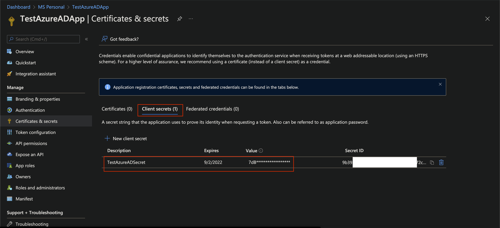

# Secure APIs on Azure behind API Management

## Introduction

Azure API Management is a hybrid, multi-cloud management service for APIs onAzure; ensuring a complete abstraction of backend APIs and its complexities from the consumer of the APIs. This allows API developers to Securely expose APIs to various types of API consumers with varying degree of access control, observability and protection mechanisms available out-of-the-box.

Azure API Management has deep integrations with Azure AD which in turn has support for with the OAuth 2.0 & OpenID Connect through **Microsoft Identity** framework. These two powerful, feature-rich resources can be leveraged to secure backend APIs without adding any code or logic within the APIs itself; thus making the Security of APIs clean, flexible and reusable

## What this Document will do?

- A detailed overview of configurations in Azure AD for **OAuth 2.0** and **OpenID Connect** 
- Deep look at the various protection mechanisms available in **Microsoft Identity** platform
- How to integrate API Management with  **OAuth 2.0** and/or **OpenID Connect** 
- Leverage built-in **Policies** in Azure API Management to secure the backend APIs

## Let us get into some Actions

### Configure Azure AD

#### Register an Application to represent te Back end APIs

- Follow these [Steps](https://docs.microsoft.com/en-us/azure/api-management/api-management-howto-protect-backend-with-aad#1-register-an-application-in-azure-ad-to-represent-the-api) to register

- Let us call this **ServerApp** to better correlate 

  

- Go to **Manifest** section of the app and update

  - **acceptMappedClaims** to **true** - This is needed to make sure that the Associated Groups are returned as part of the *OAuth 2.0*  or *OpenID* token
  - **groupMembershipClaims** option to **SecurityGroup**

  

  

- Configure **API Permission** section

  

- Add/Modify **Token Configuration** section

  - **Optional** and **Group** claims can be added

  

  

- Go to **Expose API** section and Add **Scope**

  

- 

